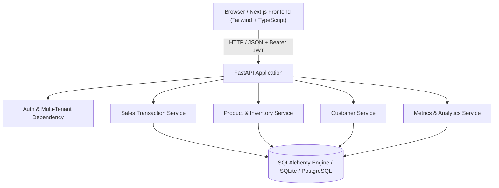

# System Architecture

## Overview

The Business Management System is designed with clean separation of concerns, multi-tenant isolation by `business_id`, and resilient transactional guarantees for inventory management.

## Component Diagram

## Inventory Transaction Safety

When a sale is requested:
1. Begin atomic database transaction.
2. For each requested item, query product by ID and lock/check current stock within the business.
3. If `requested_quantity > stock_quantity`, immediately abort and raise HTTP 400 with itemized error.
4. Decrement `product.stock_quantity = product.stock_quantity - requested_quantity`.
5. Compute line item subtotal and cumulative total.
6. Create `Sale` and child `SaleItem` records linked to `business_id` and `customer_id`.
7. Commit transaction.
